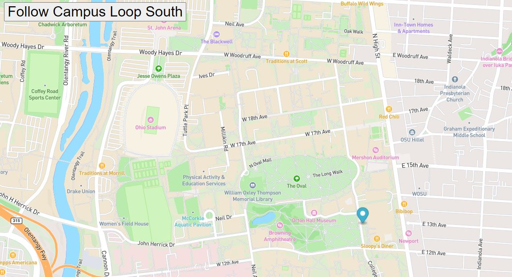

# <a href="https://github.com/jackieshreves/bus-tracker.git">Bus Tracker</a>
The purpose of this assignment was to create a tracker that will show stops on a map. I chose to use my local university's student bus line. To use the code, you will need to enter your own Mapbox API key into the tracker.html file.

